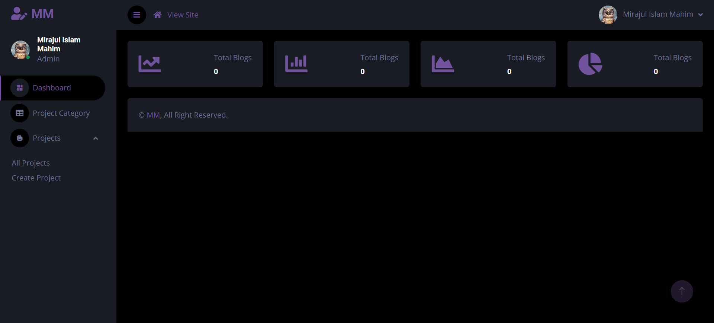

## My Portfolio Backend

<p>This is a porfolio project management backend</p>

### key Feature
- Can manage project-create,update,edit
- can manage project category
- admin management
- Can get api for connect with frontend application
- Can track website traffic


### Demo Image 
 


### To Run the project follow this step
```bash
 git clone <my-cool-project>
 composer install
 cp .env.example .env
 php artisan key:generate
 php artisan migrate
 php artisan serve

```